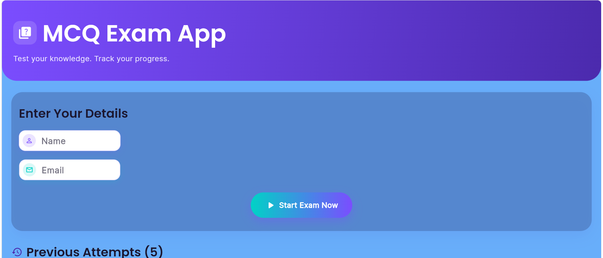
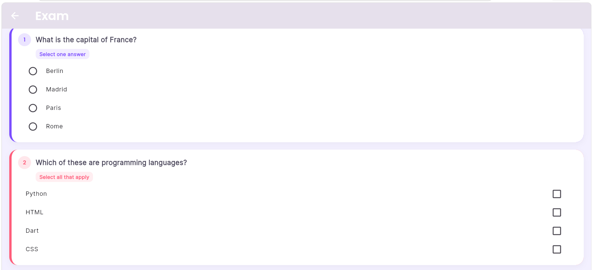
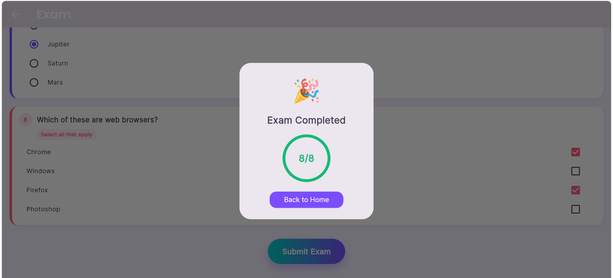
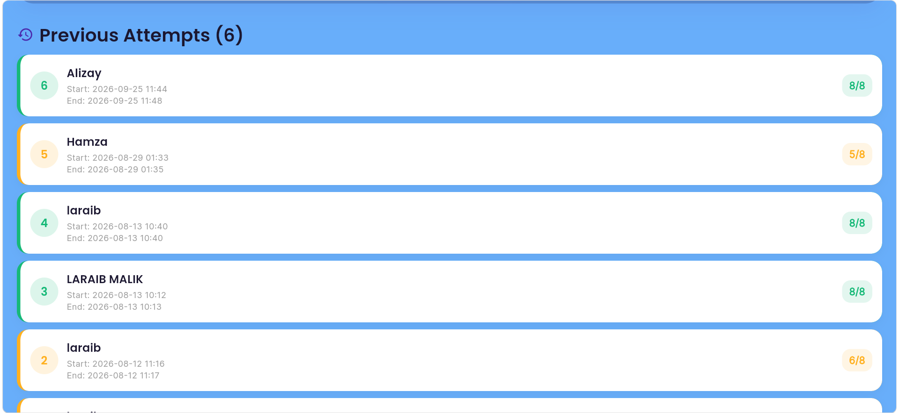

<!-- # flutter_mcq_exam_app

A new Flutter project.

## Getting Started

This project is a starting point for a Flutter application.

A few resources to get you started if this is your first Flutter project:

- [Learn Flutter](https://docs.flutter.dev/get-started/learn-flutter)
- [Write your first Flutter app](https://docs.flutter.dev/get-started/codelab)
- [Flutter learning resources](https://docs.flutter.dev/reference/learning-resources)

For help getting started with Flutter development, view the
[online documentation](https://docs.flutter.dev/), which offers tutorials,
samples, guidance on mobile development, and a full API reference. -->

# 📝 MCQ Exam App

A Flutter-based MCQ examination application that lets a user enter their details, attempt a mix of single-choice and multiple-choice questions, get instantly evaluated, and review their previous attempt history — all stored locally on the device.

---

## 📱 App Preview

| Home Screen | Exam Screen | Result | Previous Attempts |
|---|---|---|---|
|  |  |  |  ||

---

## 📖 Overview

**MCQ Exam App** is a lightweight, self-contained exam simulator built with Flutter. A candidate enters their name and email, starts the exam, answers a set of single-choice (radio button) and multiple-choice (checkbox) questions, and submits for automatic evaluation. The app tracks exam start/end time, calculates the score, and keeps a full history of previous attempts using local device storage — no backend or internet connection required.

---

## 🔄 Application Flow

```
Enter Details (Name + Email)
        ↓
   Validation
        ↓
   Start Exam
        ↓
 Answer Questions
 (Single-choice / Multiple-choice)
        ↓
   Submit Exam
        ↓
 Automatic Evaluation
        ↓
   View Result (Score + Percentage)
        ↓
  Saved to Attempt History
        ↓
 Review Previous Attempts
```

---

## ✨ Key Features

- ✅ Candidate detail entry with name & email validation
- ✅ Single-choice questions using radio buttons
- ✅ Multiple-choice questions using checkboxes (select all that apply)
- ✅ Automatic answer evaluation on submit
- ✅ Exact-match validation for multiple-choice answers
- ✅ Score and percentage-based feedback
- ✅ Exam start & end time tracking
- ✅ Persistent local history of all previous attempts
- ✅ Clean, modern UI with gradients, rounded cards, and Material 3 styling

---

## 🛠️ Technology Stack

| Layer | Technology | Purpose |
|---|---|---|
| UI Framework | Flutter | Cross-platform application interface |
| Language | Dart | Application logic |
| Design System | Material 3 | UI components and theming |
| Typography | Google Fonts (Inter & Poppins) | App-wide font styling |
| Local Storage | SharedPreferences | Persisting exam attempts on-device |
| Date & Time | `intl` | Formatting attempt timestamps |
| Navigation | Flutter Navigator | Moving between Home and Exam screens |
| Validation | Flutter Forms | Name and email field validation |
| State Management | StatefulWidget | Managing exam & UI state |
| Platform | Android (Flutter multi-platform capable) | Primary target platform |

---

## 🏗️ Project Structure

```
lib/
├── main.dart          # App entry point, theme setup
├── home_screen.dart   # Candidate details + previous attempts list
└── quiz_screen.dart   # Exam questions, evaluation, result dialog

android/                # Android platform files
web/                    # Web platform files (if enabled)
windows/                # Windows platform files (if enabled)
test/                   # Unit/widget tests
```

---

## 🧮 Exam Evaluation Logic

- **Single-choice questions** are marked correct if the selected option matches the correct answer.
- **Multiple-choice questions** require an **exact match** — every correct option must be selected, and no incorrect option should be selected — for the question to be marked correct.
- The final score is calculated as `correct answers / total questions`, along with a percentage shown in the result dialog.

---

## 💾 Local Data Persistence

- Every completed attempt (name, start time, end time, score) is saved locally using **SharedPreferences**.
- The Home screen reads and lists all saved attempts under **Previous Attempts**.
- No cloud service or database is used — all data lives on the user's device.

---

## 🎨 UI & Design

- Purple-to-blue gradient header
- Rounded cards with soft shadows
- Color-coded result indicators (green for good scores, orange/red for lower scores)
- Radio buttons for single-choice, checkboxes for multiple-choice
- Celebratory result dialog on exam completion
- Material 3 components throughout with Inter/Poppins typography

---

## 🚀 Getting Started

### Prerequisites
- [Flutter SDK](https://docs.flutter.dev/get-started/install) installed
- A connected device or emulator (Android/iOS) or a browser for web

### Installation & Run

```bash
# Clone the repository
git clone https://github.com/LaraibMalik71/mcq_exam_app.git
cd mcq_exam_app

# Get dependencies
flutter pub get

# Run the app
flutter run
```

---

## 📌 Project Status

✅ Completed — Academic Project

---

## 👤 Author

**Laraib Malik**
📧 hh2999720@gmail.com
🔗 [GitHub Profile](https://github.com/LaraibMalik71)


